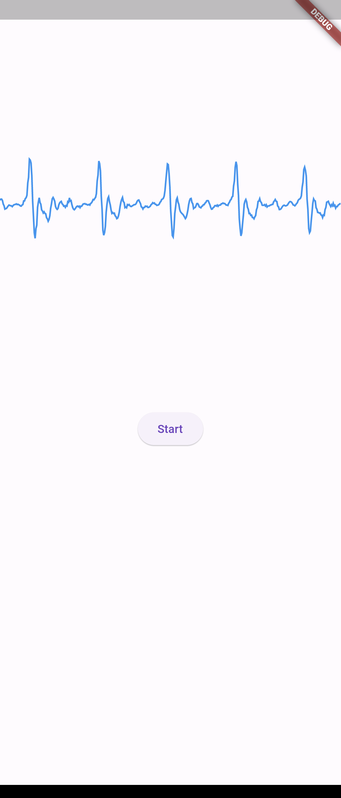

# audio_streamer_example

audio_streamerプラグインの実装例です。

音声エネルギーによるシンプルなvoice activity detectionにより、発声区間の音声データを入手しています。  
画面のグラフはデバイスのマイクから受け取った音声バッファーです。startボタンを押すと入手した音声データを再生します。  
AndroidのAcousticEchoCancelerにより、入手した音声データは検出されません。

