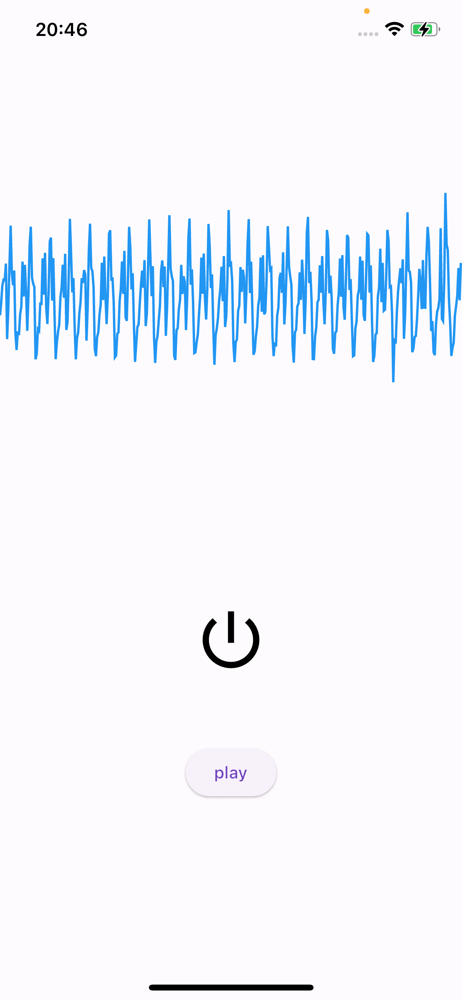

# audio_streamer_example

This is an implementation example of the audio_streamer plugin.

The graph displayed on the screen represents the audio buffer received from the device's microphone. The power button becomes active when echo cancellation is enabled. You can play sounds from local files to test echo cancellation.

